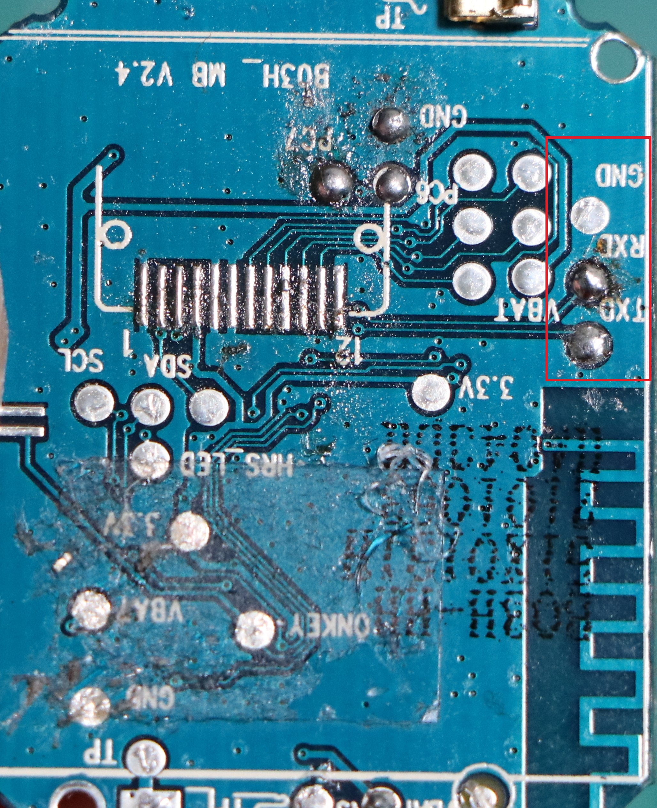
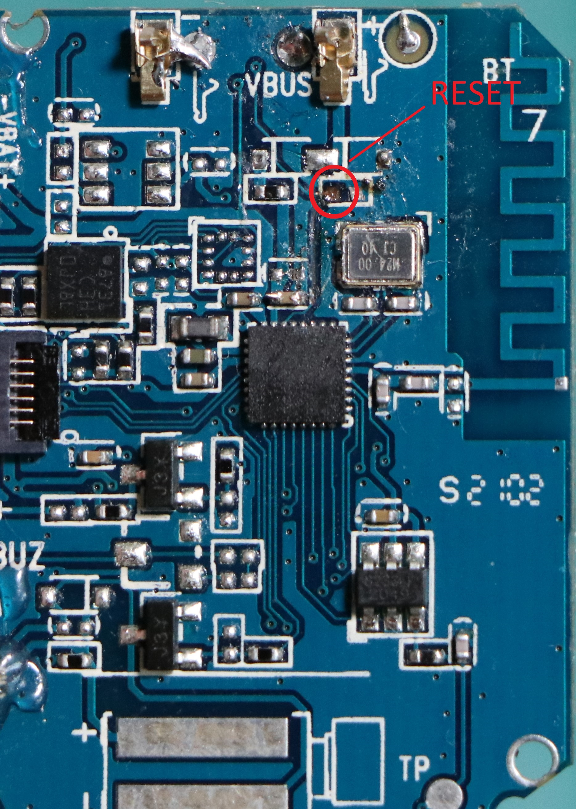

# 🕹️ d20_smartwatch

Reverse engineering and hacking a cheap smartwatch with the FR8016HA MCU.

<b>For bitmaps: </b>You can show bitmaps using `gfx_draw_rgb_bitmap` function and for generating bitmaps you can use `https://notisrac.github.io/FileToCArray/` tool with `16bit BBBBBGGGGGGRRRRR (2byte/pixel)` color order

<b>Youtube Video: </b>You can watch the demo at this video

---

## 🛠️ How to Build

1. Connect the **GND**, **TX**, **RX** pins to a UART converter.
2. Run `sdk/FR801xH-master/tools/FR8010H_Download_Tool.exe` and set your UART converter port and baudrate
   and also set the Bin file(the button contains `DAT` text) after that click on connect button(you can translate buttons btw)
3. Trigger your mcu reset pin by connecting it to vcc(you can use a simple push button to trigger it)
4. Click the one left to the last button to upload the firmware

---

## 🔌 Connection Images

<table>
  <tr>
    <td align="center">
       
      <b>RX & TX & GND PIN</b>
    </td>
    <td align="center">
       
      <b>RESET PIN(was connected to a resistor that i desolder it, you don't need too)</b>
    </td>
  </tr>
</table>
